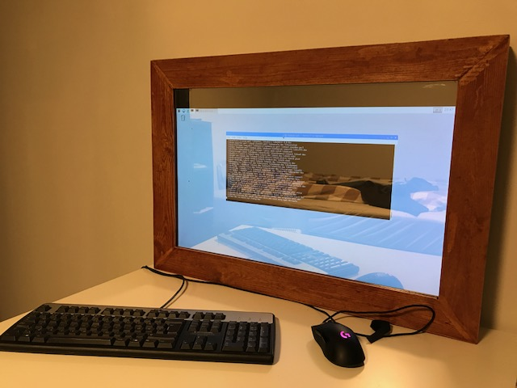
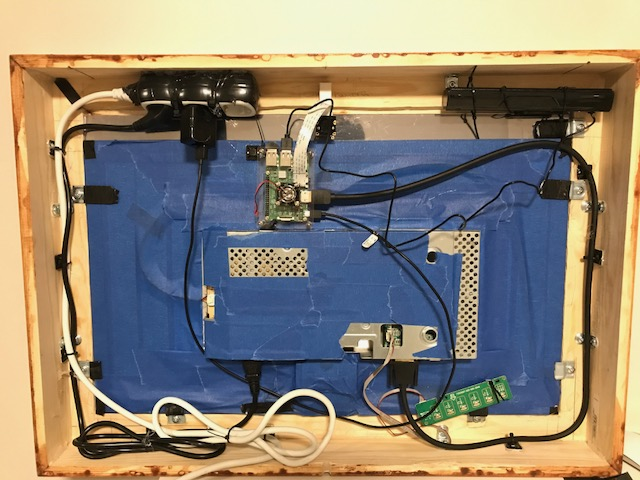

## Work-in-progress
###### 1.0.0.alpha




### Components
All components are created with Vue. If you want to build a component for this repo,
use the same structure as the rest of the components**.

#### Component wishes
- Still missing 3 modules to complete the personal build
- Calendar for today (google, apple)
   
Currently also waiting for microphone, speaker and motion sensor.

Need to write documentation for repo and usage.

### Awesome component idees
https://github.com/vicmora/MMM-GoogleMapsTraffic

https://github.com/basti0001/MMM-iHaveBeenThere

https://github.com/eouia/MMM-Assistant

https://github.com/alexyak/camera

https://github.com/sakirtemel/MMM-alexa

https://github.com/dolanmiu/MMM-awesome-alexa

https://github.com/gauravsacc/MMM-GoogleAssistant

https://github.com/RedNax67/MMM-IPCam

https://github.com/alexyak/motiondetector

#### For python
- to run the requirements file: ```pip3 install -r requirements.txt```

#### Node - installing on Raspberry Pi 3
https://tutorials-raspberrypi.com/setup-raspberry-pi-node-js-webserver-control-gpios/

To make electron work on raspberry pi
```
sudo apt-get install libxtst6
```
```
sudo apt-get install libxss1
```
```
sudo apt-get install libgconf-2-4
```
```
sudo apt-get install libnss3
```

```
libgtk2.0-0 libnotify-bin libgconf-2-4 libnss3
```

Also install electron globally

```
npm install electron -g
```

#### Thanks to:

- Python / Backend / Idea
    - https://github.com/mrtnsn

- Setup
    - https://github.com/MichMich/MagicMirror
        - Electron, express and server
        - Weather component

- Frontend
    - https://github.com/sethne
        - Weather component
