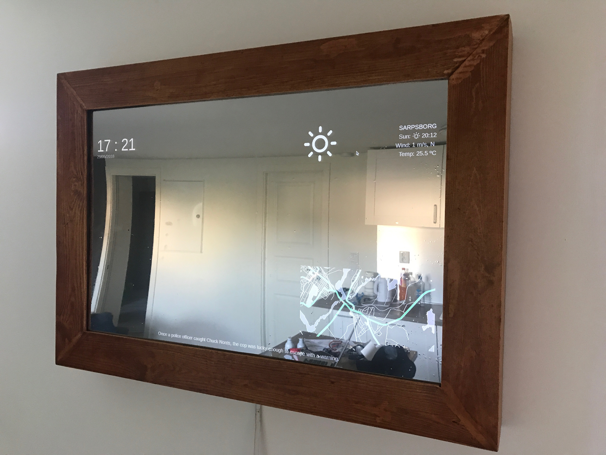

# MagicMirror

An overview of installing and configurating the application.

Built with Node, Python, Vue and Html/Css


  

#### Thanks to:
- https://github.com/MichMich/MagicMirror
    - Electron, express and server
    - Component ideas
    
- https://github.com/mrtnsn

- Frontend
    - https://github.com/sethne

## Sections

- [General - installation of OS](#general) (required)
    - Downloading OS
    - Installing GUI/packages
    - Git - clone repo
- [Javascript - Node](/docs/javascript_node.md) (required)
    - Node
    - Electron
    - NPM
- [Configuration](/docs/config.md) (required)
- [Python](/docs/python.md) (optional)
    - Docker?

## General

#### The basics of Raspberry Pi
Start by going to [raspberrypi](https://www.raspberrypi.org/downloads/raspbian) download section.
Download "Raspbian Stretch With Desktop" (electron needs a GUI, or it will not work).

If you download the Lite version (or any else for that matter), make sure you install a GUI and
required packages as described in this repo.

Use a tool to flash the image over to the SD. I recommend using [Etcher](https://etcher.io/).

To enable SSH, create a file (with no extension) and name it ```ssh``` in the root folder of the SD card that you just flashed the image to.
 
#### Installing, updating and enabling packages/services
When the OS is working and you have started your Raspberry:

- Change default password, connect to Wifi and other settings

```
sudo raspi-config
```

It does not hurt to also update the tool while you are changing some of the other settings.

- Update existing software:

```
    sudo apt-get update
    sudo apt-get full-upgrade
```

This will take a some time to download and install.

- If Git is missing, install it by running
```
    sudo apt-get install git
```

You have now a Raspberry Pi that is ready to download the Git repo by running:
```
    git clone https://github.com/smajohusic/MagicMirror.git
```

See [Javascript - Node](/docs/javascript_node.md) documentation to install required Node and npm packages.